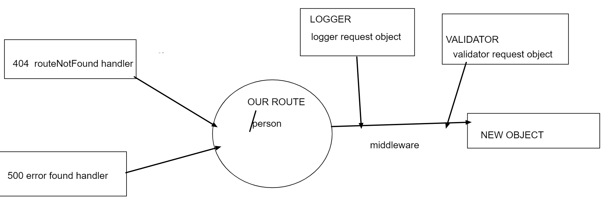

# basic-express-server

### lab- 02

### Autor rula alqasem

[master deployed link ]()

[dev branch deployed link](https://rula-basic-express-server-dev.herokuapp.com/)

[action link](https://github.com/RulaAlqasem/basic-express-server/actions)

[pull request link](https://github.com/RulaAlqasem/basic-express-server/pull/1)

[repo link](https://github.com/RulaAlqasem/basic-express-server)

### Phase 1 Requirements

building a basic Express server using best practices, use of middleware, and tests.

- Person Route
- Method: GET
- Path: /person
- Expects a query string from the user with a “name” property
- When present, output JSON to the client with this shape: { name: "name provided" }
- Without a name in the query string, force a “500” error

### Testing Requirements

- Assert the following
- 404 on a bad route
- 404 on a bad method
- 500 if no name in the query string
- 200 if the name is in the query string
- given an name in the query string, the output object is correct

### test

- run it Test: npm run test

### Documentation

- Compose a UML or Process/Data Flow Diagram for every application

